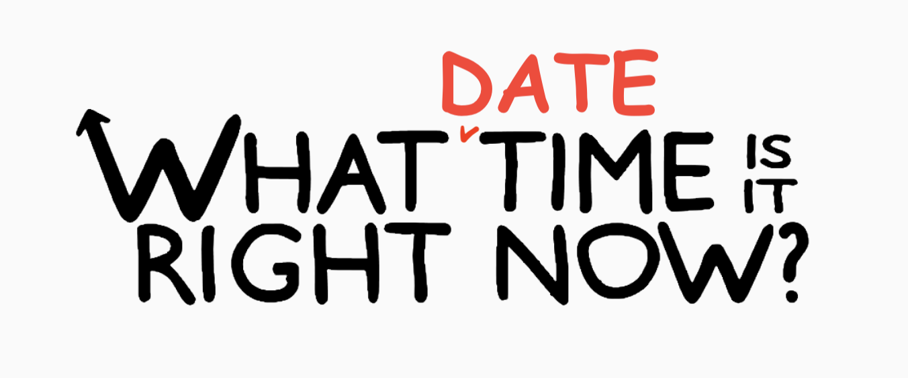

# [WhatDatetimeIsItRightNow.com](https://whatdatetimeisitrightnow.com)
A site that tells you what date and time it is right now. 

<p align="center">
  
</p>

### Run Dev
```
yarn or npm install

gatsby develop // requires gatsby-cli
```

Credits: Most Newsfeed content sourced from [/r/nottheonion](https://www.reddit.com/r/nottheonion/).